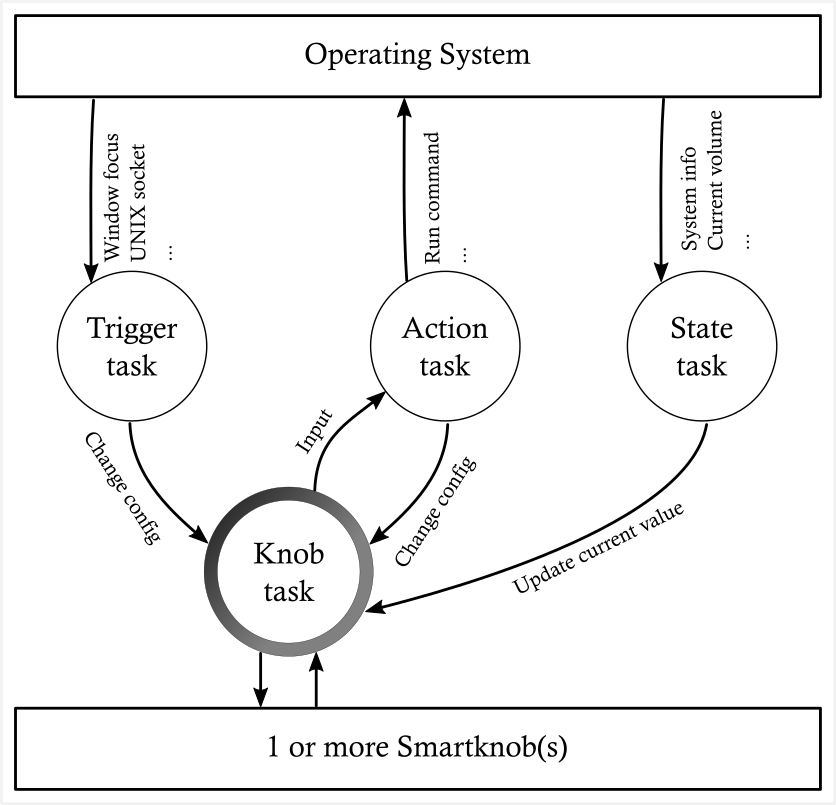

# nobbler
Host-side control software for scottbez's [SmartKnob View](https://github.com/scottbez1/smartknob)

## Features
- Set up multiple configurations for your knob(s)
- Change configuration when the knob is pressed
- Change configuration when the host's focused window changes
- Run an OS command when a knob is turned or pressed

## Ideas
- Support for multiple named knobs
  - Needs firmware support for some sort of ID. MAC of esp32, probably

- Named actions
  - Send keypress

- Named configs
  - Run a command to get current value?
    - This will probably have to be a polling thing. Kind of sucks.

- Triggers to automatically switch config
  - "Button" press
    - Filter by current config
    - If knob A is on "volume", switch it to "brightness"
  - Named knob to affect (or first)
